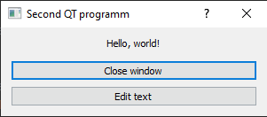

# PyQt5 samples

### Simple QT project to create templates repository

`Used PyQt 5.15.2 & Python 3.8` 

---
## Basic projects

  

### Project 1: Helloworld

- Basic Projects / helloWorld.py

### Project 2: Hello world + Edit Text

- Basic Projects / helloWorldExtra.py

### Project 3a: Load file from QT designer

- Basic Projects / loaderUI.py
- resources/sample_3.ui

### Project 3b: Convert .ui file to .py

`pyuic5 sample_3.ui -o ui_sample_3.py`

- Basic Projects / loaderPy.py
- resources/ui_sample_3.py

---

`Last improvements: 16.12.2000` 