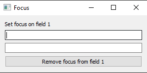
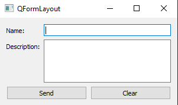
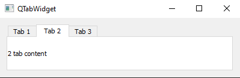
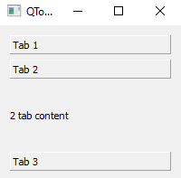
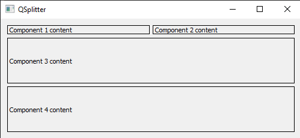

# PyQt5 mini-templates

### Simple QT projects to show QT widgets

`Used PyQt 5.15.2 & Python 3.8` 

---
## Basic projects

  

### Project 1: Helloworld

- Basic Projects / helloWorld.py

### Project 2: Hello world + Edit Text

- Basic Projects / helloWorldExtra.py

### Project 3a: Load file from QT designer

- Basic Projects / loaderUI.py
- resources/sample_3.ui

### Project 3b: Convert .ui file to .py

`pyuic5 sample_3.ui -o ui_sample_3.py`

- Basic Projects / loaderPy.py
- resources/ui_sample_3.py

### Project 4a: Thread

- Basic Projects / thread.py

### Project 4b: Signal through threads

- Basic Projects / threads.py

### Project 4с: Queue of signals to Thread

- Basic Projects / queueSample.py

### Project 4d: Mutex

- Basic Projects / mutex.py

### Project 5: Splash screen

- Basic Projects / splash.py

## Handlers 

### Project 1: Signal generator

- Handlers Project / signalGenerator.py

### Project 2: Simple timer

- Handlers Project / simpleTimer.py

### Project 3a: Input focus

  

- Handlers Project / inputFocus.py

### Project 3b: Input focus + hotkeys

- Handlers Project / inputFocusExtra.py

## Components

### Project 1: Form layout sample

  

- Components / formLayout.py

### Project 2: Tabs

  

- Components / tabWidget.py

### Project 3: Toolbox

  

- Components / toolBox.py

### Project 4: Splitter layout (Horizontal/Vertical)

  

- Components / splitter.py

---
`Last improvements: 17.12.2000` 